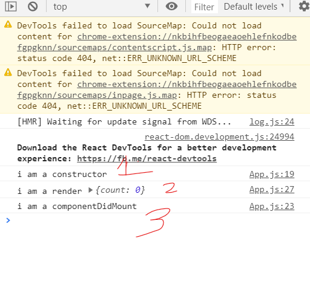

# 리엑트


- 클래스 리엑트 컴포넌트는 리턴을 가지고 있지 않는다. 왜? 펑션이 아니기 때문이다.


### 1.  어떻게 state를 관리할까?

- 왜 setState를 사용해야할까? 그냥 this.state.count++ 해도 될것을... 그 이유는 밑에 `this.setState(new object)` 는 리엑트 컴포넌트라는 클래스가 **스테이트를 갱신 할 때 마다, 랜더를 새로 해주면서 데이터를 동적으로 관리**할 수 있게 한다.

  즉! 바뀐 그 부분만 리 랜더링해준다. 전체가 아니라!!!와우 

- this.state.count에 직접 접근해서 변경하지 마라.

  ```javascript
  add = () =>{
  
    console.log("add");
  
    this.setState({count: this.state.count + 1})
  
  }
  ```

  여기서 this.state.count를 직접 호출하는것은 좋지 않다. 왜? 성능문제..  그럼 어떻게 해야하지? setState에서는 함수형으로 현재의 state를 화살표 함수로 사용할 수 있도록 제공한다.

  여기서 의문. 보통 화살표 함수는 curr=>{count: curr.count + 1} 이렇게 사용할 텐데... 왜 양 끝에 ()가 있는거지?

  모범답안

  ```javascript
  add = () =>{
  
    console.log("add");
  
      this.setState(curr=>({count: curr.count + 1}));
  
  
  }
  ```

  

# 2. Component Life cycle

- react component class에서는 render() 메소드가 실행하기 전 메소드와, 그 후에 실행되는 메소드가 있다. 


### 2.1. mounting()

맨 처음 클라이언트가 웹 페이지에 접근했을 때 발생하는 순서.

- 2.1.1 constructor()

  - 자바스크립트에서 온 문법이다. 생성자라는 의미로 랜더링 전에 실행된다.

  - 특이하게 수퍼로 상속받지 않으면 오류가 발생한다. 그이유는 아직 모르겠다.

    ```javascript
      constructor(props){
      super(props);
      console.log("i am a constructor");
    }
    
    ```

- 2.1.2 render()

  - 어플리케이션이 시작할 때 실행되는 함수. 화면을 그려주는 역할

  ```javascript
    render(){
      console.log("i am a render", this.state);
      return (
      <div>
        <h1>
          the number is {this.state.count} in my state
        </h1>
        <button onClick={this.add}>
        Add
        </button>
        <button onClick={this.minus}>
        Minus
        </button>
      </div>
      )
    }
  
  ```

- 2.1.3  componentDidMount()

  - render이후에 실행

    ```javascript
    componentDidMount(){
      console.log("i am a componentDidMount");
    
      }
    
    ```

- 실행 결과 콘솔

- 

### 2.2. updating()

```
Updating
An update can be caused by changes to props or state. These methods are called in the following order when a component is being re-rendered:

static getDerivedStateFromProps()
shouldComponentUpdate()
render() * 중요
getSnapshotBeforeUpdate()
componentDidUpdate() * 중요
```

state나 props가 변경되었을때 일어나는 라이프 사이클

- 2.2.1 render()
  - 바뀜을 인지하면 랜더를 하고, 그다음 컴포넌트 디드 업데이트라는 함수가 호출된다.

- 2.2.2 componentDidUpdate()
  - 변경후 뭔가 후작업이 필요할때 여기서 행한다.?

### 2.3. unmounting()

-  해당 페이지가 죽었을때, 페이지를 바꾸거나 할때


# 3. Fecth data

- 화면을 보여주는 전략
  - 1) render()를 통해 정적인 화면을 먼저 보여준 뒤
  - 2) 동적으로, 혹은 차 후에 로딩으로 불러올 데이터는 `componentDidMount()` 메서드를 이용해 받아온다.
- Fetch vs Axios
  - axios는 fetch의 기능을 조금 더 쉽고, 직관적인 방법으로 사용할 수 있게 해주는 라이브러리
  - axios를 다운받아야 쓸 수 있다. `npm install axios`

- movie data를 가져와 보자.
  - 1) YTS -> 맨 밑에 api 버튼클릭 -> list movies -> `https://yts.mx/api/v2/list_movies.json`
  - 2) 하지만 위의 api버전이 계속 바뀌므로, -> `https://yts-proxy.now.sh/list_movies.json`노마드코드가 만든 더미 api를 사용한다.

### Endpoint Parameters

| Parameter         | Required | Type                                                         | Default    | Description                                                  |
| :---------------- | :------- | :----------------------------------------------------------- | :--------- | :----------------------------------------------------------- |
| `limit`           |          | Integer between 1 - 50 (inclusive)                           | 20         | The limit of results per page that has been set              |
| `page`            |          | Integer (Unsigned)                                           | 1          | Used to see the next page of movies, eg limit=15 and page=2 will show you movies 15-30 |
| `quality`         |          | String (720p, 1080p, 2160p, 3D)                              | All        | Used to filter by a given quality                            |
| `minimum_rating`  |          | Integer between 0 - 9 (inclusive)                            | 0          | Used to filter movie by a given minimum IMDb rating          |
| `query_term`      |          | String                                                       | 0          | Used for movie search, matching on: Movie Title/IMDb Code, Actor Name/IMDb Code, Director Name/IMDb Code |
| `genre`           |          | String                                                       | All        | Used to filter by a given genre (See http://www.imdb.com/genre/ for full list) |
| `sort_by`         |          | String (title, year, rating, peers, seeds, download_count, like_count, date_added) | date_added | Sorts the results by choosen value                           |
| `order_by`        |          | String (desc, asc)                                           | desc       | Orders the results by either Ascending or Descending order   |
| `with_rt_ratings` |          | Boolean                                                      | false      | Returns the list with the Rotten Tomatoes rating included    |

 출처: https://yts.mx/api#list_movies


-  then catch VS async await 

  ```javascript
  // then catch
  
    componentDidMount(){
      // fetch 는 여기서!
      const url = "https://yts-proxy.now.sh/list_movies.json?limit=50";
      Axios.get(url)
      .then(response=>{
        this.setState(curr =>({isLoading: false, movies: 					response.data.data.movies}))
      })
      .catch(console.error);
  
    }
  
  // async await
    getMovies = async () =>{
      const url = "https://yts-proxy.now.sh/list_movies.json?limit=50";
      try {
        const movies = await Axios.get(url);      
        this.setState(curr =>({isLoading: false, movies: movies.data.data.movies}))
  
         //  신박하네
         //       const {data:{data:{movies}}} = await Axios.get(url);
         //      this.setState(curr =>({isLoading: false, movies:movies}))
  
          
      } catch(err){
        console.error(err)
      }
    }
  
    componentDidMount(){
      this.getMovies();
  }
  
  ```

  

- async await가 .then보다 더 좋은 이유

  - 1) 간결하다.
  - 2) 체인함수로 이루어진 메소드의 에러구문을 명확하게 찾을 수 있다.
  - 3) nesting을 피할 수 있다.(nesting: 중괄호 파티)
  - 4) 디버깅시 await에 브레이크 포인트를 잡을 수 있다.


